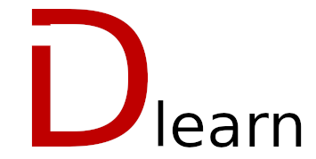

# Dlearn



[](https://github.com/rjkilpatrick/dlearn/releases)
[](https://github.com/rjkilpatrick/dlearn/issues)
[](https://github.com/rjkilpatrick/dlearn/actions/workflows/unit-test.yml)
[](https://app.codecov.io/gh/rjkilpatrick/dlearn)
[](https://github.com/rjkilpatrick/dlearn/blob/main/LICENSE)

High-level Linear algebra and scientific computing package in D.

## Table of contents

- [State of the Project](#state-of-the-project)
- [Getting Started](#getting-started)
  - [Prerequisites](#prerequisites)
  - [Using with dub](#using-with-dub)
- [Usage](#usage)
- [Testing](#testing)
- [Building the Documentation](#building-the-documentation)
- [Contributing](#contributing)
- [License](#license)

## State of the Project

The **API** is in very early stages and is subject to change **without notice**.
If you are using it in your own projects, please pin to an [exact version](https://github.com/dlang/dub/wiki/Version-management).

## Getting Started

### Prerequisites

1. [dub](https://dub.pm/)
1. [dmd / ldc](https://dlang.org/download.html)

### Using with dub

To use this package, run the following command in the root directory of your project

```sh
dub add dlearn
```

Or manually add the following to your dub.json

```json
"dlearn": "~>0.0.2"
```

See [dub](https://code.dlang.org/packages/dlearn) for details.

### Single File

```d
#!/usr/bin/env dub
/+ dub.sdl:
	name "name_of_your_application"
	dependency "matplotlib-d" version="~>0.1.4"
+/
void main() {
  import dlearn.allocation : ones;
  auto x = ones!double(2, 2);
}
```

## Usage

```d
import std : writeln;
import dlearn.allocation : ones, eye;
import dlearn.math : sinh;
import dlearn.linalg : matrixMultiply;

auto x = ones!double(2, 2);
auto y = x.matrixMultiply(eye!double(2));
y.sinh.writeln;
```

For more examples, please refer to the [Documentation](https://rjkilpatrick.github.io/dlearn/).

## Testing

To build the package and run all unit tests (in parallel if possible):

```sh
dub test --parallel
```

## Building the Documentation

Dlearn uses `ddox` documentation generator which you can build with:

```sh
dub build -b ddox
```

Or you can build and then run a webserver with:

```sh
dub run -b ddox
```

## Contributing

If you find a bug, please [submit an issue](https://github.com/rjkilpatrick/dlearn/issues).

Any and all contributions are appreciated.
If you think of a feature you'd like added, or how we can improve the project, submit an issue too.

## License

dlearn is distributed under the MIT license, as found in [LICENSE](LICENSE).
